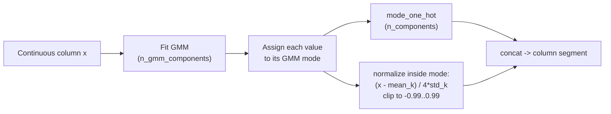
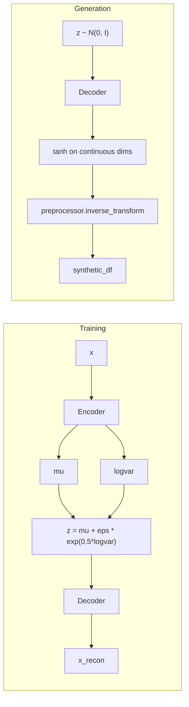

# abSynth

**A Tabular Variational Autoencoder (TVAE) for synthetic data generation, built from scratch in PyTorch with an evaluation suite covering statistical fidelity, downstream ML utility, and memorization risk.**

abSynth learns a generative model of a real tabular dataset (mixed continuous and categorical columns) and samples new rows that preserve its statistical structure well enough to train a classifier on. It's validated end-to-end on two public datasets: the UCI Adult Income Census (classification, class imbalance) and California Housing (regression).

The preprocessing, loss function, model-selection criterion, and training loop are all implemented directly on `torch.nn`, not wrapped around SDV or CTGAN. The two notebooks in `experiments/` then benchmark the output against real data using SDMetrics, XGBoost, and SMOTENC.

---

## Problem Statement & Motivation

Real tabular datasets are hard to share and hard to work with:

- **Class imbalance.** In the Adult Income dataset, `>50K` is roughly a third the size of `<=50K`. SMOTE-style oversampling interpolates between existing minority points. A VAE instead samples from a learned distribution, which can better capture what a plausible minority-class row looks like when features have non-trivial joint structure.
- **Data augmentation.** A trained generator can produce more rows than you have, for load-testing pipelines, unit tests, or demos, without hand-rolling fake data with unrealistic value distributions.
- **Privacy (exploratory).** Learning a distribution instead of copying rows is a reasonable starting point for sharing data more safely. abSynth does **not** implement differential privacy or any formal privacy guarantee — the memorization check later in this README is empirical, not a proof of privacy.

abSynth tests one claim: can a self-implemented VAE produce synthetic tabular data that's statistically similar to the real thing and useful for training downstream models?

---

## Results at a Glance

| | Adult Income (classification) | California Housing (regression) |
|---|---|---|
| SDMetrics Quality Score | 83.5% | 82.4% |
| Downstream utility (TSTR / TRTR) | 94.5% accuracy, 93.7% AUC | 71.6% R² |
| Minority-class recall, real vs. TVAE-augmented | 0.569 → **0.792** | — |
| Minority-class efficacy, TVAE vs. SMOTENC | **0.611** vs. 0.603 | — |
| Memorization check (DCR score) | 0.943 (50.4% / 49.6% train-vs-holdout split) | — |

A classifier trained only on synthetic Adult Income data recovers ~94% of real-data accuracy and AUC. TVAE-based minority oversampling lifts recall by 22 points and slightly beats SMOTENC on efficacy score. On California Housing, a regressor trained on synthetic data retains ~72% of real-data R². Full breakdown with per-metric tables is in [Experimental Setup & Evaluation](#experimental-setup--evaluation).

---

## Architecture & System Design

### 1. Data representation (mode-specific normalization)

A "continuous" column like `capital-gain` is often multimodal (a mass at zero, plus a skewed tail), so a single Gaussian doesn't fit it well. `TVAEPreprocessor` (`src/preprocessor.py`) handles this with mode-specific normalization, the approach used by CTGAN/TVAE (Xu et al., 2019):



Categorical columns are one-hot encoded over the observed vocabulary. Every column ends up as a segment in the model's input/output vector, tagged `"discrete"` (mode indicators, categorical one-hots → cross-entropy loss) or `"continuous"` (the normalized scalar → Gaussian NLL loss). `TVAEPreprocessor.get_output_info()` returns this `(start_idx, dim, kind)` layout and is passed straight into the model, so preprocessing and loss stay in sync — `TVAE.__init__` raises immediately if they don't. `inverse_transform` reverses the whole process.

### 2. Model and generation flow

Encoder and decoder are configurable MLPs (`Linear → BatchNorm → ReLU → Dropout`). Latent dimensionality (`latent_dim`) is swept experimentally rather than fixed (see Evaluation).



### 3. Loss: ELBO with a column-aware reconstruction term

The objective is `L = recon_loss + beta * KL`, where `recon_loss` applies a different likelihood per segment based on `output_info`:

- **Continuous segments** — Gaussian NLL with a learned, per-feature standard deviation (`self.sigma`, clamped to `[0.01, 1.0]` after every step). The decoder output is passed through `tanh` first.
- **Discrete segments** (GMM mode indicators, categorical one-hots) — cross-entropy against the target, optionally class-weighted for imbalanced columns.
- **KL term** — closed-form KL between `N(mu, diag(sigma^2))` and the standard normal prior.

This is a **beta-VAE**: `beta` is configurable, and the trainer supports a **linear KL warm-up** (`beta_start → beta` over `beta_warmup_epochs`), so the decoder learns reconstruction before the KL term starts pulling the posterior toward the prior. Both experiments use this during the sweep and final training.

For imbalanced discrete columns, `compute_discrete_class_weights` (`src/diagnostics.py`) computes class-balanced weights using the effective-number-of-samples formulation (Cui et al., 2019), so the loss doesn't default to just predicting the majority class.

### 4. Model selection: checkpointing on prior calibration, not val loss

Validation loss only measures whether the decoder can reconstruct *encoded* points — it says nothing about whether the aggregate posterior actually matches the `N(0, I)` prior sampled from at generation time. A model can reconstruct well while its posterior drifts from the prior, which produces poor output when decoding fresh samples.

`prior_mismatch_score` (`src/diagnostics.py`) measures how far the posterior mean and standard deviation are from `0` and `1` respectively, averaged across the validation set. `TVAETrainer.fit` computes this every epoch and checkpoints on the **lowest prior mismatch**, restoring that checkpoint at the end of training — targeting the failure mode that actually matters for generation quality, instead of validation loss.

### 5. Latent dimension selection: an automated sweep

`run_latent_dim_sweep` (`src/train.py`) trains short runs across candidate `latent_dim` values, records `(final_val_loss, prior_mismatch)` for each, and picks the lowest val loss among candidates whose `prior_mismatch` is under a threshold (default `0.3`) — falling back to the lowest mismatch if none pass. Both experiment notebooks use this before the full training run.

---

## Key Features & Innovation

- **Column-aware mixed likelihood** — Gaussian NLL for continuous scalars, cross-entropy for discrete segments, driven by an `output_info` contract that keeps preprocessor and model in sync.
- **Learned, clamped, per-feature noise scale** — `sigma` is trained jointly with the network and clamped to `[0.01, 1.0]` to keep the loss stable.
- **Beta-VAE with linear KL warm-up**, to avoid posterior collapse early in training.
- **A generation-aware checkpoint criterion** (`prior_mismatch_score`) instead of raw validation loss.
- **Automated, criterion-driven latent-dimension selection** (`run_latent_dim_sweep`).
- **Class-balanced discrete reconstruction loss** for imbalanced categorical/mode distributions.
- **Clean module boundaries**: preprocessing, model + training loop, orchestration, inference, and diagnostics are separate files with narrow interfaces — not one monolithic script.

---

## Experimental Setup & Evaluation

Two datasets, two problem types, same pipeline: preprocess → sweep latent dim → train final model → reconstruct → generate → evaluate.

### A. UCI Adult Income Census (`experiments/adult_income_census.ipynb`)

Binary classification (`class`: `<=50K` / `>50K`), 45,222 rows after dropping missing values, 6 continuous + 9 categorical columns, 80/20 train/holdout split. Preprocessed shape: `(36177, 136)`.

**Latent dimension sweep** (30 epochs, `beta=0.5`, 10-epoch warm-up, threshold `prior_mismatch < 0.3`):

| latent_dim | final val loss | prior_mismatch |
|---|---|---|
| 4  | -4.716 | 0.031 |
| 8  | -5.815 | 0.054 |
| **12** | **-7.340** | **0.083** |
| 16 | -6.799 | 0.129 |

→ `latent_dim=12` selected (lowest val loss among candidates under the mismatch threshold).

**Final training** (150 epochs, `beta=0.5`, 50-epoch warm-up): final val loss **-9.191**, checkpointed at **prior_mismatch = 0.0624**. Reconstruction MSE (transformed space): **11.87**.

**Statistical fidelity — SDMetrics `QualityReport`:**

| Metric | Score |
|---|---|
| Column Shapes | 84.33% |
| Column Pair Trends | 82.66% |
| **Overall** | **83.5%** |

**Downstream ML utility — TSTR (Train on Synthetic, Test on Real) vs. TRTR baseline**, XGBoost on the real holdout set:

| Metric | TRTR (real) | TSTR (synthetic) | Ratio |
|---|---|---|---|
| Accuracy | 0.8737 | 0.8254 | 94.5% |
| F1 (weighted) | 0.8693 | 0.8186 | 94.2% |
| ROC AUC | 0.9284 | 0.8699 | 93.7% |

A classifier trained purely on synthetic data recovers **~94%** of real-data accuracy/F1 and AUC, with no access to the original rows.

**Class imbalance mitigation.** Real training class counts: `<=50K` = 27,172, `>50K` = 9,005 (deficit of 18,167 to reach balance). The trained TVAE generated batches and was filtered down to the minority class (20,513 collected in one pass, 18,167 used), compared against **SMOTENC** on the same deficit via SDMetrics' `BinaryClassifierRecallEfficacy` (XGBoost, fixed precision = 0.9):

| Augmentation | Recall (val) | Precision (val) | Efficacy score |
|---|---|---|---|
| None (real only) | 0.569 | 0.837 | — |
| **TVAE-augmented** | **0.792** | 0.666 | **0.611** |
| SMOTENC-augmented | 0.776 | 0.668 | 0.603 |

Both strategies lift minority recall by 20+ points at a similar precision cost; TVAE-based oversampling edges out SMOTENC here while sampling from a learned joint distribution rather than nearest-neighbor interpolation.

**Memorization check — SDMetrics `DCROverfittingProtection`:**

```
score: 0.9429
synthetic rows closer to training set: 50.4%
synthetic rows closer to holdout set:   49.6%
```

A near-50/50 split means synthetic rows aren't systematically closer to training data than to unseen holdout data — evidence against naive memorization. This is an empirical check, not a formal privacy guarantee (no differential privacy is implemented in this project).

### B. California Housing (`experiments/house_pricing.ipynb`)

Regression (`MedHouseVal`), 20,640 rows, 9 continuous columns. Preprocessed shape: `(16512, 54)`.

**Latent dimension sweep** (30 epochs, `beta=1`, no warm-up):

| latent_dim | final val loss | prior_mismatch |
|---|---|---|
| **4**  | **-2.831** | **0.204** |
| 8  | -2.777 | 0.549 |
| 12 | -2.731 | 0.628 |
| 16 | -2.737 | 0.679 |

→ `latent_dim=4` is the only candidate under the threshold, and is selected — this dataset needs a smaller bottleneck to stay prior-calibrated than Adult Income does.

**Final training** (100 epochs): final val loss **-3.151**, prior_mismatch **0.150**. Reconstruction MSE: **13.29**.

**Statistical fidelity — SDMetrics `QualityReport`:**

| Metric | Score |
|---|---|
| Column Shapes | 77.12% |
| Column Pair Trends | 87.69% |
| **Overall** | **82.4%** |

**Downstream ML utility — regression**, `GradientBoostingRegressor` predicting `MedHouseVal` on the real holdout set:

| | R² |
|---|---|
| Trained on real data | 0.776 |
| Trained on synthetic data | 0.555 |
| **Utility ratio** | **71.6%** |

A model trained only on synthetic housing data retains about 72% of real-data R² — weaker than the classification result, and reported as-is: continuous, skewed regression targets are a harder generation target for a mixture-based VAE than a mostly-categorical classification problem.

---

## Repository Structure

```
abSynth/
├── src/
│   ├── __init__.py
│   ├── preprocessor.py   # TVAEPreprocessor: GMM mode-specific normalization + one-hot categoricals
│   ├── model.py           # TVAEConfig, Encoder, Decoder, TVAE (loss), TVAETrainer (fit loop)
│   ├── train.py           # train_tvae_model(), run_latent_dim_sweep()
│   ├── inference.py       # encode_data, decode_latent, reconstruct, generate_synthetic_samples
│   └── diagnostics.py     # prior_mismatch_score(), compute_discrete_class_weights()
├── experiments/
│   ├── adult_income_census.ipynb   # classification + imbalance mitigation + memorization check
│   └── house_pricing.ipynb         # regression case study
├── _idea/
│   └── tvae_rnd.ipynb              # early exploratory / prototyping notebook
└── .gitignore
```

`src/` is a self-contained, importable package — everything the experiments use (`TVAEPreprocessor`, `TVAEConfig`, `train_tvae_model`, `run_latent_dim_sweep`, `generate_synthetic_samples`, `reconstruct`) is defined there and imported, not copy-pasted into notebooks.

---

## Getting Started & Usage

### Installation

```bash
git clone https://github.com/Srayash/abSynth.git
cd abSynth
pip install torch numpy pandas scikit-learn xgboost sdv sdmetrics imbalanced-learn matplotlib
```

### 1. Preprocess a dataset

```python
import pandas as pd
from src.preprocessor import TVAEPreprocessor, TVAEPreprocessorConfig

df = pd.read_csv("your_data.csv")

config = TVAEPreprocessorConfig(
    n_gmm_components=5,
    log_transform_columns=["skewed_nonneg_column"],  # optional
)
preprocessor = TVAEPreprocessor(config)

transformed = preprocessor.fit_transform(
    df,
    continuous_columns=["age", "income", ...],
    categorical_columns=["gender", "region", ...],
)

input_dim = preprocessor.get_output_dim()
output_info = preprocessor.get_output_info()  # needed by the model's loss
```

### 2. Sweep latent dimension, then train

```python
import torch
from torch.utils.data import TensorDataset, DataLoader
from src.model import TVAEConfig, set_seed
from src.train import run_latent_dim_sweep, train_tvae_model
from src.diagnostics import compute_discrete_class_weights

set_seed(42)

dataset = TensorDataset(torch.FloatTensor(transformed))
train_ds, val_ds = torch.utils.data.random_split(dataset, [0.8, 0.2])
train_loader = DataLoader(train_ds, batch_size=64, shuffle=True)
val_loader = DataLoader(val_ds, batch_size=64, shuffle=False)

class_weights = compute_discrete_class_weights(transformed, output_info)

sweep_config = TVAEConfig(
    input_dim=input_dim,
    output_info=output_info,
    num_epochs=30,
    beta=0.5, beta_start=0.0, beta_warmup_epochs=10, use_beta_warmup=True,
    discrete_class_weights=class_weights,
)
best_latent_dim, sweep_df = run_latent_dim_sweep(
    sweep_config, candidate_dims=[4, 8, 12, 16], train_loader=train_loader, val_loader=val_loader,
)

final_config = TVAEConfig(
    input_dim=input_dim,
    output_info=output_info,
    latent_dim=best_latent_dim,
    num_epochs=150,
    beta=0.5, beta_start=0.0, beta_warmup_epochs=50, use_beta_warmup=True,
    discrete_class_weights=class_weights,
)
model, trainer, history = train_tvae_model(final_config, train_loader, val_loader, verbose=True)
```

### 3. Evaluate

```python
import numpy as np
from src.inference import reconstruct
from src.diagnostics import prior_mismatch_score

recon = reconstruct(model, transformed, "cpu", output_info)
print("Reconstruction MSE:", np.mean((transformed - recon) ** 2))
print("Prior mismatch (target < 0.3):", prior_mismatch_score(model, transformed, "cpu"))
```

### 4. Generate synthetic data

```python
from src.inference import generate_synthetic_samples

synthetic_transformed = generate_synthetic_samples(model, n_samples=10_000, device="cpu", output_info=output_info)
synthetic_df = preprocessor.inverse_transform(synthetic_transformed)
```

`synthetic_df` is a plain `pandas.DataFrame` with the same columns and dtypes as the original data, ready to score with SDMetrics or feed to a downstream model.

See `experiments/adult_income_census.ipynb` and `experiments/house_pricing.ipynb` for the full evaluation pipelines reproduced above.